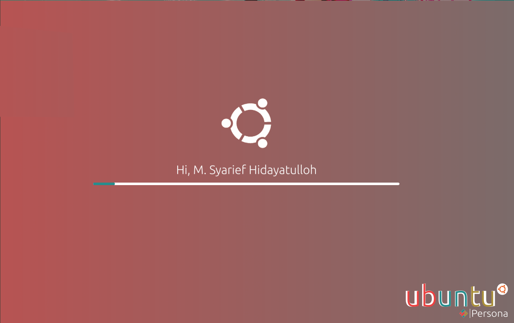

<div align="center">
	<h1>Persona_Plymouth</h1>
	<p>Minimalize progress bar to Persona</p>
	
</div


how To install
<div
1. open terminal
2. enter this
```
git clone https://github.com/personaproject/persona_plymouth
cd persona_plymouth
chmod ug+x ./install.sh
./install.sh
```
</div

How to Edit

1. open terminal
2. enter this command
```
sudo nautilus /usr/share/plymouth/themes/persona/
```
3. a.) (logo centre) replace ubuntu.png with your picture (give your picture name "ubuntu.png" without "") 
   b.) (Hi, Text) replace msh_text.png with your picture (give your picture name "msh_text.png" without "")

Any Questions?
Plz contact me on
me.msyariefh@gmail.com
085225915434 (Whatsapp)

